<!-- Social Links -->
[![LinkedIn][linkedin-shield]][linkedin-url]
[![Instagram][instagram-shield]][instagram-url]
[![Twitter][twitter-shield]][twitter-url]
[![Hashnode][hashnode-shield]][hashnode-url]

# Paytm-Clone Web-Site

### Some of screen-shots of my paytm-clone website.

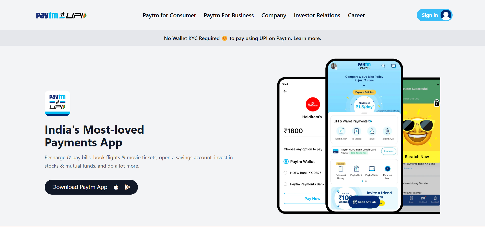
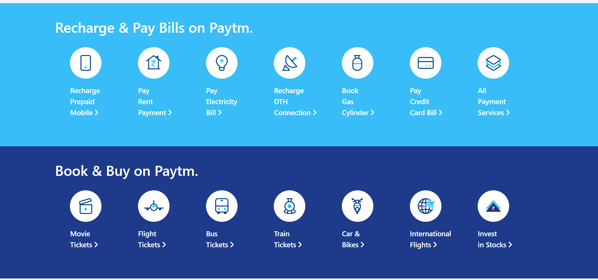
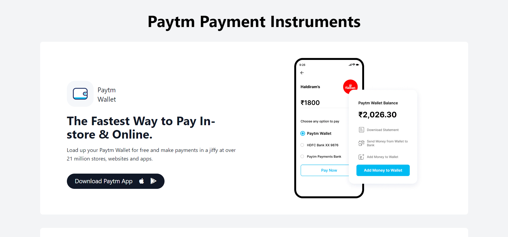
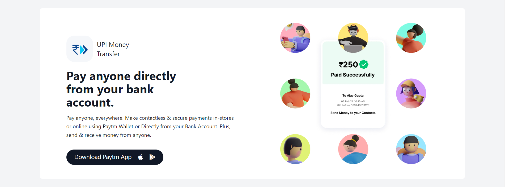
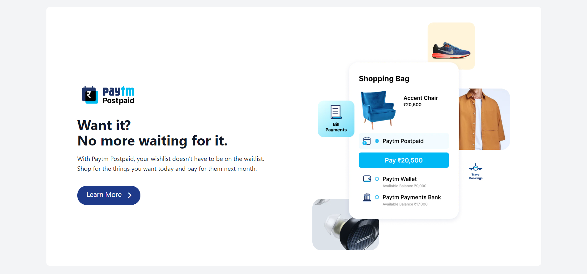

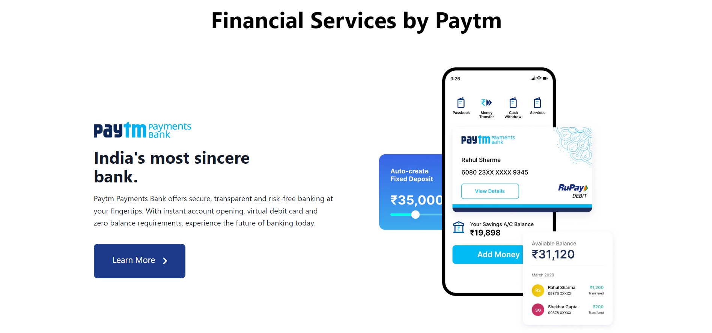
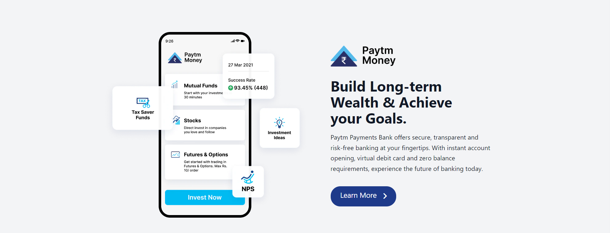

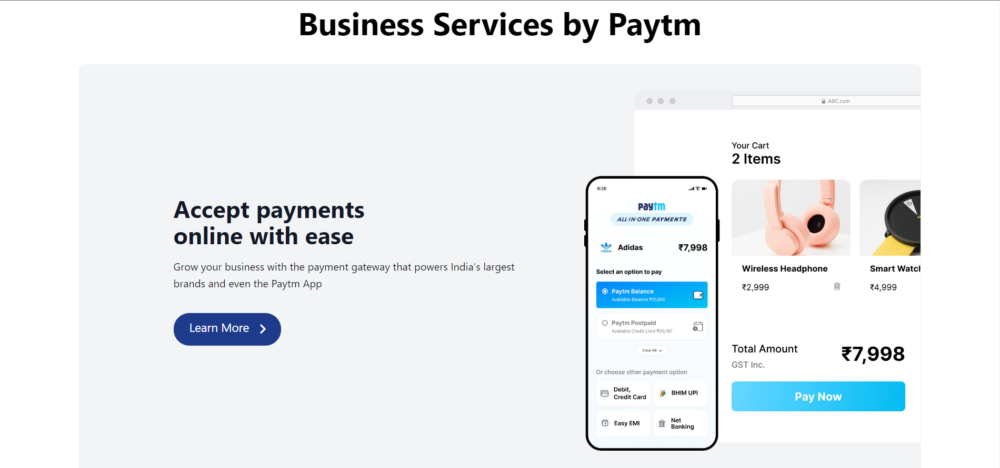

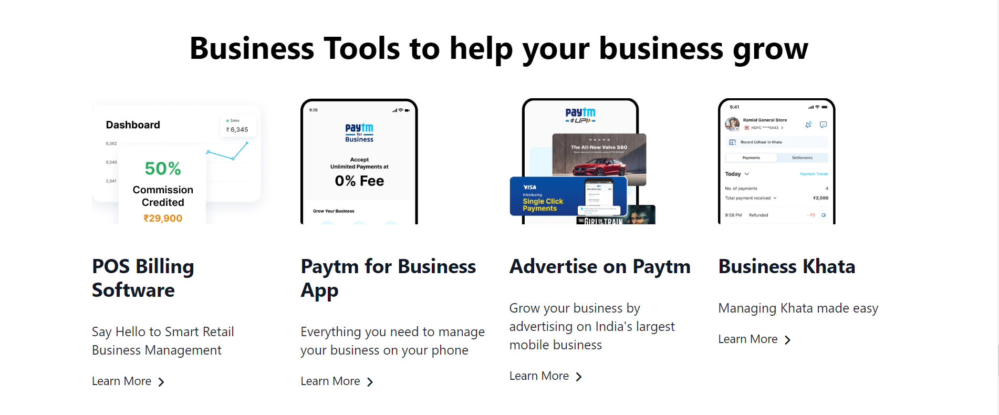
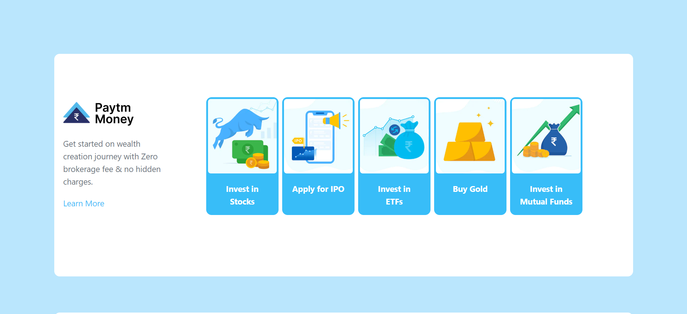
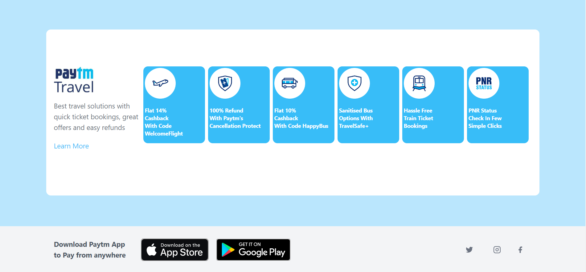

### 👇Live Demo

[Link](https://vb-paytm-clone.netlify.app/)

---

# 📋Features

- There is a most impressive feature's is `Responsive`.
    - Yes, This clone website is mobile-responsive 😀. But Orignal website is `not Responsive`.

> You can see the [Orignal-Web-Site](https://paytm.com/).
---

# 🛠️Technologies used

- HTML
- TailWind CSS

---

## Contact

- **Name 👨‍💻:** [Vandit Bera](https://github.com/vandit-bera)
- **Email 📧:** [vanditbera@gmail.com](mailto:vanditbera@gmail.com)
- **Blog 📝:** [blogs.Vandit2510.in](https://vandit-bera.hashnode.dev/)

---

#### Project Link: [https://github.com/vandit-bera/Paytm-Clone](https://github.com/vandit-bera/Paytm-Clone)

---

<!-- Linkedin -->

[linkedin-shield]: https://img.shields.io/badge/-LinkedIn-black.svg?style=for-the-badge&logo=linkedin&colorB=0B5FBB
[linkedin-url]: https://www.linkedin.com/in/vandit-bera-4a0b02221/

<!-- Instagram -->

[instagram-shield]: https://img.shields.io/badge/Instagram-%23E4405F.svg?style=for-the-badge&logo=Instagram&logoColor=white
[instagram-url]: https://instagram.com/vandit.bera

<!-- Twitter -->

[twitter-shield]: https://img.shields.io/badge/Twitter-%231DA1F2.svg?style=for-the-badge&logo=Twitter&logoColor=white
[twitter-url]: https://twitter.com/vandit_bera_

<!-- Hashnode -->

[hashnode-shield]: https://img.shields.io/badge/Hashnode-2962FF?style=for-the-badge&logo=hashnode&logoColor=white
[hashnode-url]: https://vandit-bera.hashnode.dev/
